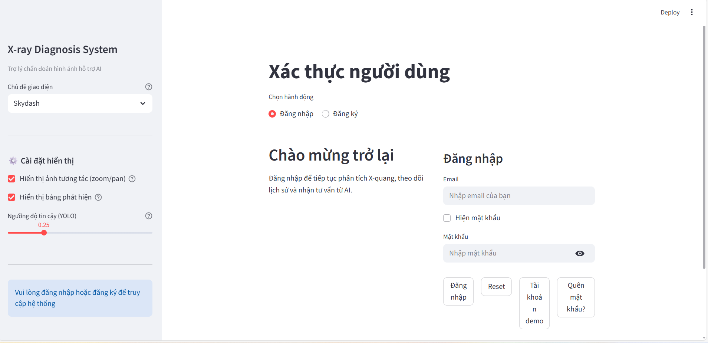
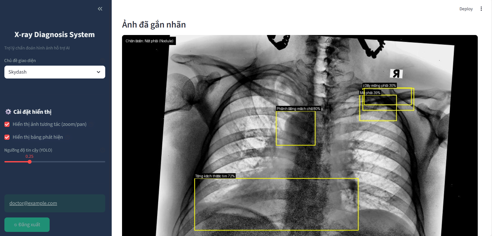
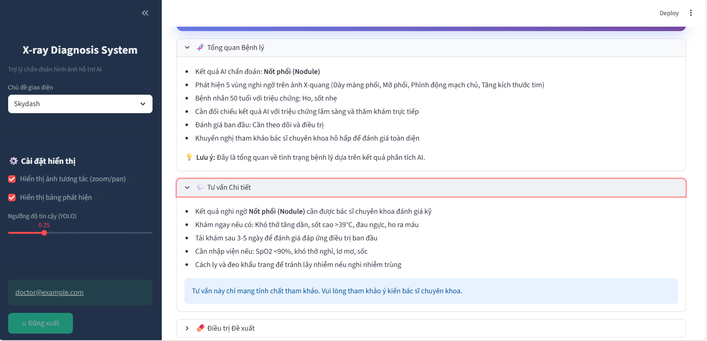

<h2 align="center">
  <a href="https://dainam.edu.vn/vi/khoa-cong-nghe-thong-tin">
    🎓 Faculty of Information Technology (DaiNam University)
  </a>
</h2>
<h2 align="center">
   Hệ thống chẩn đoán X-quang phổi hỗ trợ AI (X-ray Diagnosis System)
</h2>
<div align="center">
    <p align="center">
        
        
        
    </p>

[](https://www.facebook.com/DNUAIoTLab)
[](https://dainam.edu.vn/vi/khoa-cong-nghe-thong-tin)
[](https://dainam.edu.vn)

</div>

## 1. Giới thiệu hệ thống
Hệ thống chẩn đoán X-quang phổi hỗ trợ AI sử dụng các mô hình trí tuệ nhân tạo (AI) để phân tích ảnh X-quang phổi, phát hiện các tổn thương và cung cấp tư vấn y khoa tự động. Hệ thống bao gồm các mô hình AI tiên tiến như **ResNet50** cho phân loại bệnh lý, **YOLOv8** cho phát hiện tổn thương, và **Gemini AI** để sinh tư vấn y khoa chi tiết. Các tính năng chính của hệ thống bao gồm:

- 📸 Phân tích ảnh X-quang để nhận diện bệnh lý phổi
- 🔍 Phát hiện tổn thương trong phổi (ví dụ: khối u, viêm phổi)
- 📊 Cung cấp các báo cáo về tình trạng bệnh và hướng điều trị
- 📤 Sinh tư vấn y khoa hỗ trợ bác sĩ trong quá trình ra quyết định điều trị

---

## 2. Công nghệ sử dụng
<div align="center">
<a href="https://python.org/"></a>
<a href="https://opencv.org/"></a>
<a href="https://pytorch.org/"></a>
<a href="https://ultralytics.com/yolov5"></a>
<a href="https://gemini.ai/"></a>
<a href="https://www.sqlite.org/"></a>
</div>

Trong đó:
- **Python**: Ngôn ngữ lập trình chính để triển khai các mô hình AI và xử lý ảnh.
- **OpenCV**: Thư viện hỗ trợ xử lý ảnh và chuyển đổi ảnh X-quang.
- **PyTorch**: Thư viện học sâu hỗ trợ huấn luyện mô hình ResNet50.
- **YOLOv8**: Mô hình phát hiện đối tượng để nhận diện các tổn thương trong ảnh X-quang.
- **Gemini AI**: Mô hình ngôn ngữ lớn cung cấp tư vấn y khoa tự động.
- **SQLite**: Hệ quản trị cơ sở dữ liệu để lưu trữ thông tin bệnh nhân và kết quả phân tích.

---

## 3. Một số hình ảnh hệ thống
Bạn có thể đặt ảnh minh họa vào thư mục `docs/` và tham chiếu như bên dưới. Nếu chưa có, hãy tạo thư mục `docs` và thêm ảnh sau.

<div align="center">

<table>
  <tr>
    <td align="center">
      <br/>
      <b>Màn hình đăng nhập</b>
    </td>
    <td align="center">
      <br/>
      <b>Dashboard Bác sĩ</b>
    </td>
  </tr>
  <tr>
    <td align="center">
      <br/>
      <b>Phân tích X-quang</b>
    </td>
    <td align="center">
      <br/>
      <b>Báo cáo Y khoa</b>
    </td>
  </tr>
</table>

</div>

---

## 4. Các bước cài đặt

### 4.1. Cài đặt môi trường
- Cài đặt Python 3.7+ : https://python.org/
- Cài đặt MySQL Server (tùy chọn nếu lưu trữ kết quả vào cơ sở dữ liệu): https://dev.mysql.com/downloads/
- Git (khuyến nghị): https://git-scm.com/downloads

IDE gợi ý: VS Code (với các extension cho Python, React).

### 4.2. Clone source code
Mở PowerShell và chạy:

```powershell
git clone <repository-url>
cd xray_diagnosis_system
4.3. Cài đặt và chạy chương trình

Cài đặt dependencies

# Backend
cd backend
pip install -r requirements.txt

# Frontend
cd ../frontend
npm install


Chạy hệ thống (2 terminal riêng)

# Terminal 1 - Backend
cd backend
python app.py

# Terminal 2 - Frontend
cd frontend
npm start


Backend: http://localhost:5001

Frontend: http://localhost:3000

## 📬 5. Liên hệ

 👤 **Họ và tên:** Nguyễn Việt Ninh  
 🎓 **Khoa:** Công nghệ thông tin – Trường Đại học Đại Nam  
 🌐 **Website:** [Khoa CNTT – DNU](https://dainam.edu.vn/vi/khoa-cong-nghe-thong-tin)  
 📧 **Email:** [nvninh2804@gmail.com](mailto:nvninh2804@gmail.com)  
 📱 **Fanpage:** [AIoTLab – FIT DNU](https://www.facebook.com/DNUAIoTLab)  

---

<p align="center">
  © 2025 AIoTLab, Faculty of Information Technology, DaiNam University. All rights reserved
</p>
